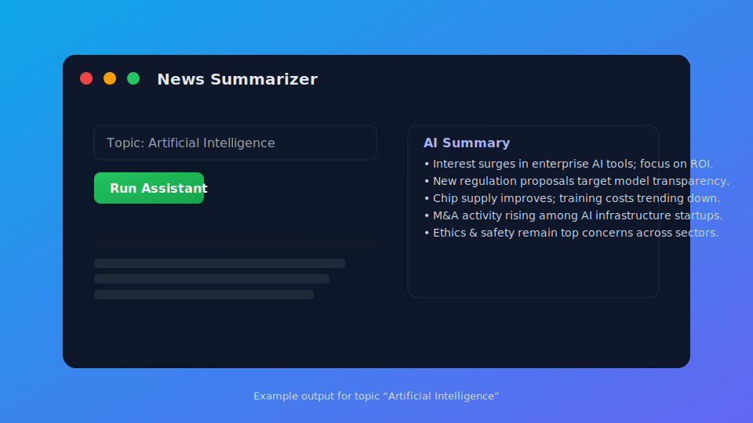

# Resumidor de Noticias

<p align="center">
	
</p>

Una aplicación de resumido de noticias basada en Python que utiliza los modelos GPT de OpenAI y la API de News para obtener y resumir artículos de noticias sobre cualquier tema dado.

## Características

- Obtiene los últimos artículos de noticias usando News API
- Utiliza la API Assistant de OpenAI para resumir el contenido de noticias
- Interfaz web interactiva de Streamlit
- Soporta cualquier tema o palabra clave de noticias

## Configuración

1. Clona este repositorio:
```bash
git clone <repository-url>
cd news-summarizer
```

2. Instala las dependencias requeridas:
```bash
pip install -r requirements.txt
```

3. Crea un archivo `.env` en el directorio raíz con tus claves API:
```
NEWS_API_KEY=tu_clave_api_noticias_aqui
OPENAI_API_KEY=tu_clave_api_openai_aqui
```

## Claves API Requeridas

- **News API**: Obtén tu clave API gratuita de [NewsAPI.org](https://newsapi.org/)
- **OpenAI API**: Obtén tu clave API de [OpenAI Platform](https://platform.openai.com/)

## Uso

### Ejecutar la Aplicación Streamlit

```bash
streamlit run main.py
```

Esto iniciará una interfaz web donde puedes:
1. Ingresar un tema de interés
2. Hacer clic en "Run Assistant" para obtener y resumir noticias
3. Ver el resumen generado por IA de artículos recientes

### Ejecutar Pruebas

```bash
python test.py
```

## Descripción de Archivos

- `main.py`: Aplicación principal con interfaz Streamlit e integración de OpenAI Assistant
- `test.py`: Script de prueba para la funcionalidad de resumido de noticias
- `requirements.txt`: Dependencias de Python
- `.env`: Variables de entorno para claves API (no incluido en el repositorio)
- `.gitignore`: Archivo de ignorar Git para excluir archivos y directorios sensibles

## Cómo Funciona

1. **Obtención de Noticias**: Utiliza News API para recuperar los últimos 5 artículos para un tema dado
2. **Procesamiento de IA**: Utiliza la API Assistant de OpenAI con llamadas de función para procesar datos de noticias
3. **Resumido**: El asistente de IA analiza artículos y proporciona resúmenes concisos
4. **Interfaz Web**: Streamlit proporciona una interfaz web fácil de usar para la interacción

## Dependencias

- `python-dotenv`: Para gestión de variables de entorno
- `openai`: Cliente API de OpenAI
- `requests`: Solicitudes HTTP para News API
- `streamlit`: Framework de interfaz web

## Ejemplo

Aquí tienes un ejemplo de cómo funciona el Resumidor de Noticias:

1. **Entrada**: Ingresa el tema "Artificial Intelligence" en la aplicación Streamlit.
2. **Procesamiento**: La aplicación obtiene los últimos artículos de noticias sobre "Artificial Intelligence" usando la API de News y los resume usando el modelo GPT de OpenAI.
3. **Salida**: Se muestra un resumen conciso de los artículos principales en la aplicación.

<p align="center">
	
</p>

La imagen anterior muestra una salida de ejemplo para el tema "Artificial Intelligence."

## Nota

Asegúrate de mantener tus claves API seguras y nunca las confirmes en el control de versiones. El archivo `.env` ya está incluido en `.gitignore` para este propósito.

---

## Versiones de Idioma

Este README está disponible en los siguientes idiomas:
- [English](README.md) - Versión original
- [Español](README-es.md) - Esta versión

Para contribuir con traducciones o actualizaciones, consulta nuestras [Guías de Traducción](.github/TRANSLATION_GUIDELINES.md).